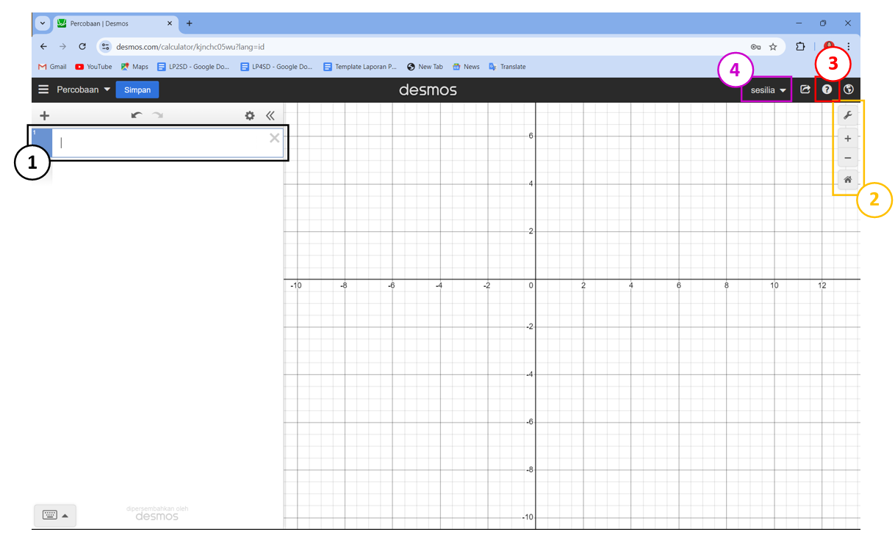
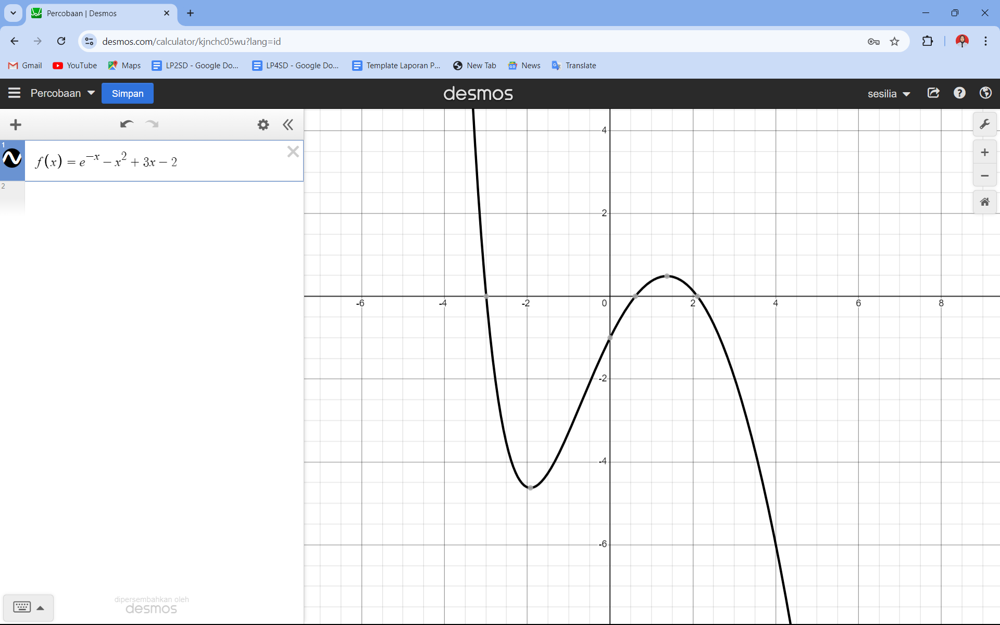

# 
 REVIEW APLIKASI DESMOS 

## Pengertian Aplikasi

<b>Desmos</b> adalah aplikasi berbasis web yang menyediakan alat interaktif untuk menggambar grafik fungsi matematika, menyelesaikan persamaan, dan menganalisis data. Aplikasi ini dirancang untuk membantu pengguna memahami konsep-konsep matematika melalui visualisasi grafis yang intuitif dan dinamis.

## Pengembang Aplikasi 

Desmos dikembangkan oleh Desmos, Inc., sebuah perusahaan teknologi pendidikan yang didirikan pada tahun 2011 oleh Eli Luberoff. Perusahaan ini fokus pada pengembangan alat-alat matematika interaktif untuk meningkatkan pembelajaran dan pengajaran matematika di berbagai tingkat pendidikan.

## Tujuan Aplikasi 
Tujuan utama Desmos adalah untuk memfasilitasi pemahaman konsep-konsep matematika dengan menyediakan alat visual yang memungkinkan pengguna menggambar, menganalisis, dan mengeksplorasi grafik fungsi serta data. Aplikasi ini bertujuan untuk membuat pembelajaran matematika lebih interaktif, menarik, dan mudah diakses bagi siswa dan guru.

## Manfaat Aplikasi
1. Memudahkan pengguna dalam memahami hubungan antara variabel melalui grafik yang dinamis.
2. Menawarkan pengalaman belajar yang lebih interaktif dengan kemampuan untuk memodifikasi fungsi dan parameter secara real-time.
3. Memfasilitasi eksplorasi konsep-konsep matematika yang kompleks dalam konteks yang lebih mudah dipahami.
4. Menyediakan alat untuk analisis statistik dan visualisasi data, mendukung pembelajaran yang berbasis data.
5. Menyediakan berbagai materi dan aktivitas yang mendukung pembelajaran aktif dan personalisasi sesuai kebutuhan siswa.

## Tampilan Aplikasi
Dibawah ini merupakan tampilan awal ketika kita membuka Desmos;

<b>Keterangan :</b>
1. Area utama di sebelah kanan layar adalah ruang grafik kosong yang siap untuk digunakan. Di sinilah pengguna dapat melihat visualisasi dari fungsi atau persamaan yang dimasukkan.
2. Toolbar kecil yang berisi ikon-ikon untuk mengubah pengaturan tampilan grafik, seperti memperbesar atau memperkecil tampilan, mengatur grid, dan mengatur skala sumbu. 
3. Ikon menu yang memberikan akses ke dokumentasi, tutorial, dan berbagai sumber daya pembelajaran lainnya.
4. User Account and Profile (Akun Pengguna dan Profil) Jika pengguna sudah masuk ke dalam akun Desmos, di pojok kanan atas akan terlihat ikon profil pengguna yang memberikan akses ke pengaturan akun dan proyek-proyek yang disimpan.  

Dibawah ini merupakan tampilan kekita kita mengetikan sebuah persamaan dan aplikasi Desmos langsung membrikan tampilan grafik dari persamaan yang telak kita ketikan.

## Akses Apllikasi
Untuk akses aplikasi lebih lanjut, [klik di sini](https://www.desmos.com/calculator/ycfghxltn1?lang=id "Kunjungi Aplikasi").

